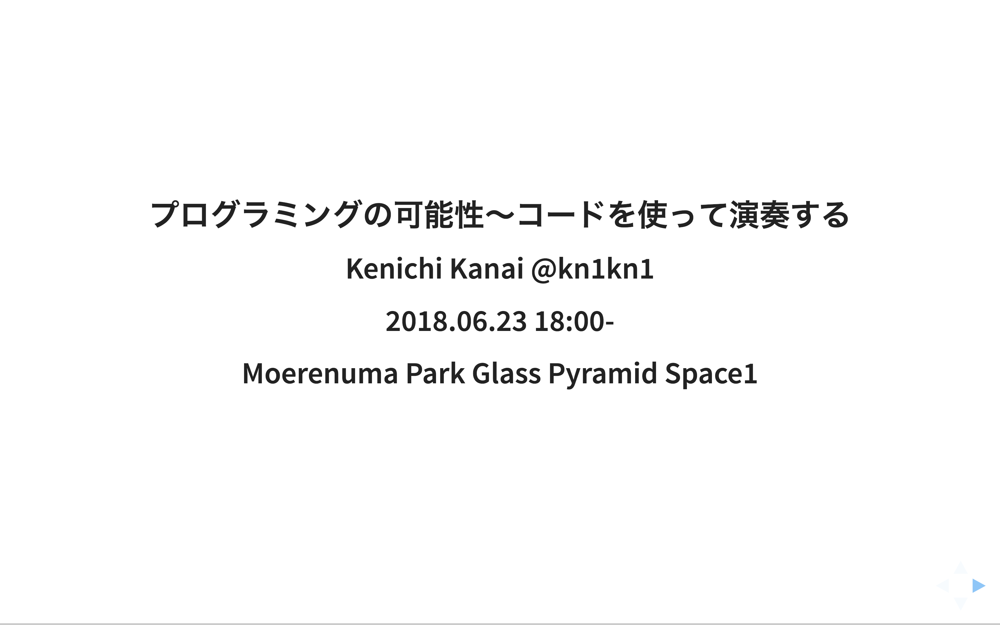
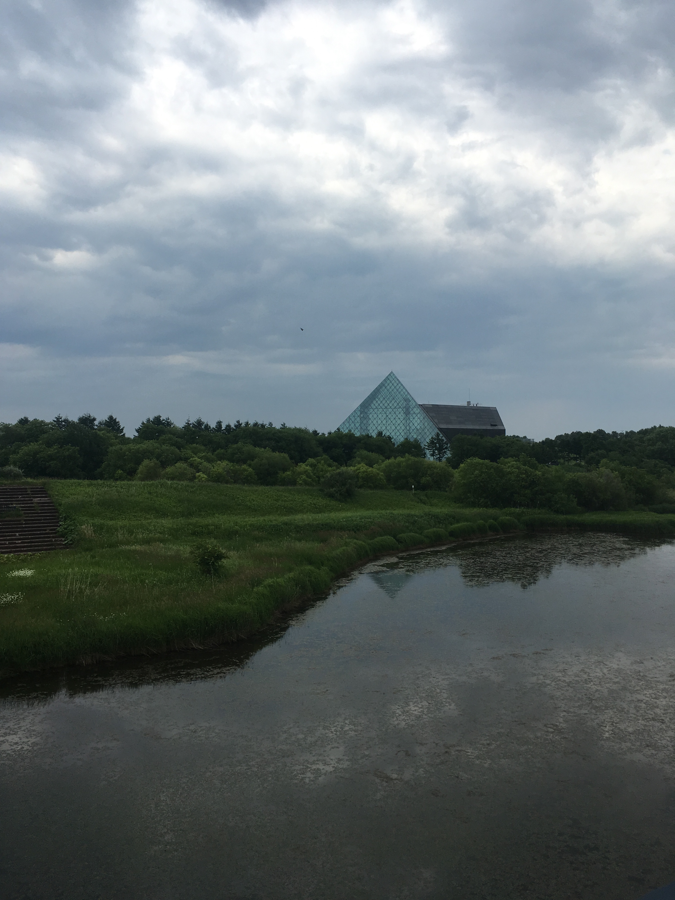
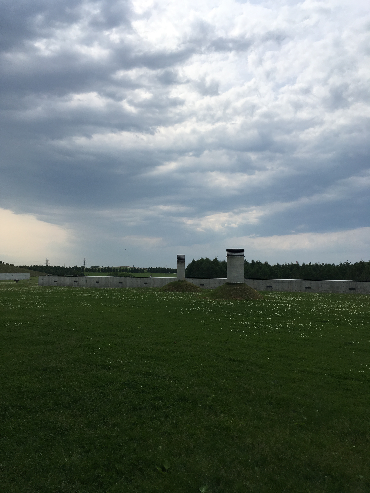
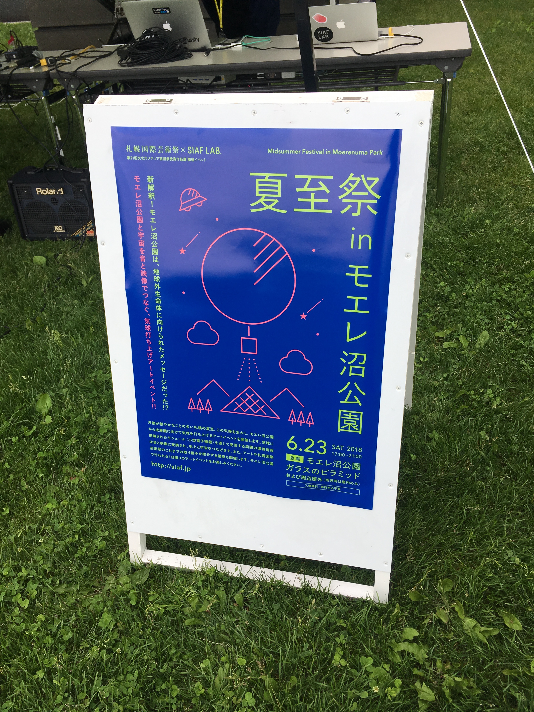
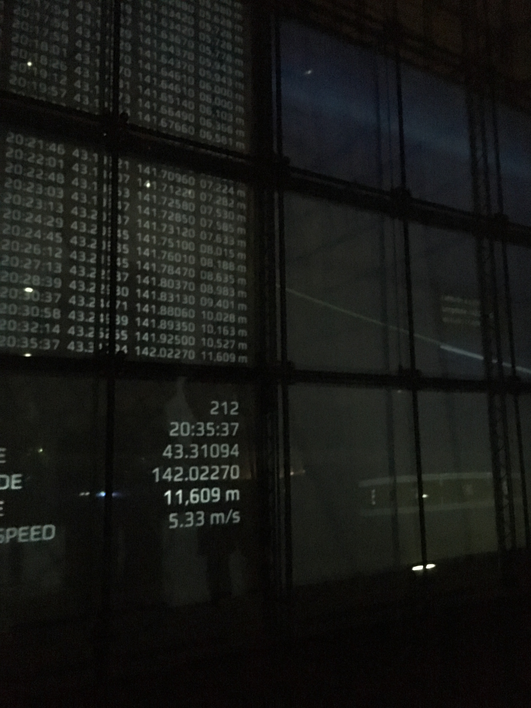
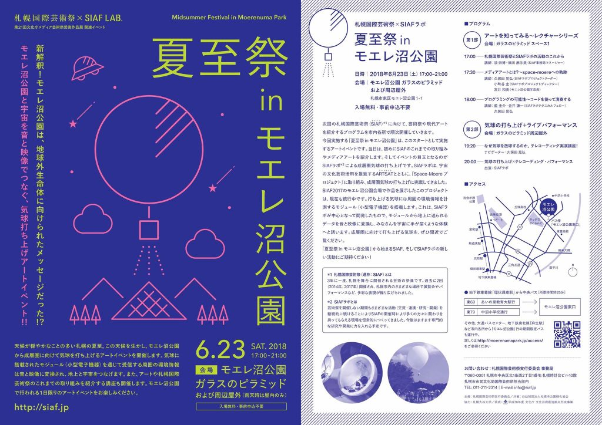

### 夏至祭 in モエレ沼公園 レクチャー資料

https://siaf.jp/midsummerfestival/

https://space-moere.org/midsummer/

```
日時：2018年6月23日(土) 17:00–21:00
会場：モエレ沼公園 ガラスのピラミッド および周辺屋外（札幌市東区モエレ沼公園1-1）

プログラム：
第1部　アートを知ってみる〜レクチャーシリーズ（会場：ガラスのピラミッド スペース1）

18:00– プログラミングの可能性〜コードを使って演奏する
講師：藍 圭介・金井 謙一（SIAFラボテクニカルフェロー）
久保田 晃弘
```

#### [スライド資料](slide/slide.pdf)

<a href="slide/slide.pdf"></a>

#### その他
##### 当日の様子






##### フライヤー

<a href="images/midsummerfestival.pdf" rel="noopener" target="_blank"></a>
