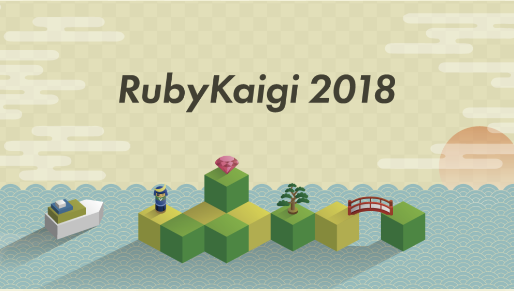
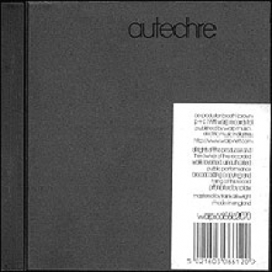

<!-- .slide: data-background="#FFFFFF" data-transition="page" -->
#### プログラミングの可能性〜コードを使って演奏する
##### Kenichi Kanai @kn1kn1
###### 2018.06.23 18:00-
###### Moerenuma Park Glass Pyramid Space1

---
<!-- .slide: data-background="#FFFFFF" data-transition="page" -->
#### Petal

- https://github.com/siaflab/petal
- a small language on [Sonic Pi](http://sonic-pi.net/) with similar syntax to [TidalCycles](https://tidalcycles.org).

---
<!-- .slide: data-background="#FFFFFF" data-transition="page" -->

---
<!-- .slide: data-background="#FFFFFF" data-transition="page" -->
#### RubyKaigi 2018

- https://rubykaigi.org/2018/presentations/kn1kn1.html#jun02

---
<!-- .slide: data-background="#FFFFFF" data-transition="page" -->
- A History of Live Programming
  - http://liveprogramming.github.io/liveblog/2013/01/a-history-of-live-programming/

- ライブコーディング入門 – Sonic Pi
  - https://drive.google.com/file/d/1aRqftLfNk0B0Ig7MgmOSib0TPz8kOocx/view

---
<!-- .slide: data-background="#FFFFFF" data-transition="page" -->

- Autechre/LP5 (1998)

---
<!-- .slide: data-background="#FFFFFF" data-transition="page" -->

- FADER Vol.4 (1999) Autechre

---
<!-- .slide: data-background="#FFFFFF" data-transition="page" -->
#### SuperCollider
- コード・コンポジション入門
  - http://dp.idd.tamabi.ac.jp/dsc/

---
<!-- .slide: data-background="#FFFFFF" data-transition="page" -->
#### ChucK
- https://kn1kn1.github.io/2009/03/20/chuck.html

---
<!-- .slide: data-background="#FFFFFF" data-transition="page" -->
#### Sonic Pi
- Live coding at CCSS2015 Closing Party
  - https://vimeo.com/137140871#t=40s
    - https://github.com/kn1kn1/ccss2015

---
<!-- .slide: data-background="#FFFFFF" data-transition="page" -->
#### TidalCycles
- Tidalでライブコーディング! - セットアップ編
  - https://qiita.com/yoppa/items/41805cc6af62b1047a34
    - https://qiita.com/yoppa/items/41805cc6af62b1047a34/revisions/0

---
<!-- .slide: data-background="#FFFFFF" data-transition="page" -->
#### Petal

- https://github.com/siaflab/petal
- a small language on [Sonic Pi](http://sonic-pi.net/) with similar syntax to [TidalCycles](https://tidalcycles.org).

---
<!-- .slide: data-background="#FFFFFF" data-transition="page" -->
#### Algosix
- https://algorave.com/wearesix/

---
<!-- .slide: data-background="#FFFFFF" data-transition="page" -->
- Tokyo Telecoders
  - https://www.youtube.com/watch?v=IUPqNhcsxcI&index=66&list=PLMBIpibV-wQIxnJ2juNj5CDfK6zF3Elcv

- a livecoding chat experiment by FCCGuam
  - https://www.youtube.com/watch?v=VTxrPCbBbEI&list=PLMBIpibV-wQIxnJ2juNj5CDfK6zF3Elcv&index=102
